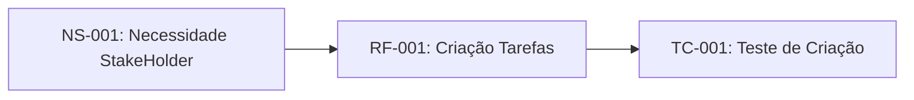

# Sistemas de Gestão de Tarefas

## 1. Introdução 

### 1.1. Propósito do Projeto
 
 Este documento especifica os requisitos funcionais e não-funcionais para o sistema de gestão de tarefas (sgt), seguindo o padrão IEEE 29148:2018.

 ### 1.2 Escopo

 O sgt permitirá que usuários criem, organizem e acompanhem tarefas pessoais e profissionais com sistema de prioridade e prazos.

 ### 1.3 Definição e Acrônimos 

 - **SGT**: Sistema de Gestão de Tarefas 
 - **RF**: Requisito Funcional 
 - **RNF**: Requisito Não-Funcional 
 - **Sprint**: Período de 2 Semanas de desenvolvimento 
  
### 1.4 Referências 

- IEEE 28148:2018 - Systems and software engineering 
- CMMI for development. version 2.0.

## 2. Descrição Geral

### 2.1 Perspectiva do Produto 

O sgt será uma aplicação web responsiva com sincronização em nuvens.

### 2.2 Funções Principais

- Criação e edição de tarefas 
- Organização por projetos e tags
- Sistema de notificação 
- Relatórios de produtividade

## 3. Requisitos Específicos

### 3.1 Requisitos Funcionais 

#### RF-001: Criação de Tarefas 

**Descrição**: O sistema deve permitir que usuários criem tarefas  com título, descrição, data de vencimento e proridade.
**Prioridade**: Alta.
**Versão**: 1.0
**Data**: 2026-03-27 
**Rastreabilidade**: Derivado da necessidade do stakeholder NS-001

**Critérios de Aceitação**:
- [ ] Formulário com campos obrigatórios (Título) e Opcionais 
- [ ] Validação de data (não permitir datas passadas)
- [ ] Níveis de prioridade: baixa, média e alta
- [ ] Confirmação visual após criação
  
  **Dependências**: Nenhuma

 ---

 #### RF-002: Organização por Projetos

**Descrição**: O sistema deve permitir agrupar tarefas em projetos personalizados
**Prioridade**: Alta.
**Versão**: 1.0
**Data**: 2026-03-27 
**Rastreabilidade**: Derivado da necessidade do stakeholder NS-002

**Critérios de Aceitação**:
- [ ] Usuário pode criar, renomear  excluir projetos
- [ ] Tarefas podem ser atribuidas a um ou nenhum projetogi
- [ ] Visualização filtrada por projeto
  
  **Dependências**: RF-001

---
#### RF-003: Alterar a Tarefa Para Concluído

**Descrição**: O sistema deve permitir alterar a tarefa para concluída
**Prioridade**: Média.
**Versão**: 1.0
**Data**: 2026-04-10
**Rastreabilidade**: Derivado da necessidade do stakeholder NS-001

**Critérios de Aceitação**:
- [ ] Usuário pode alterar a tarefa para concluída
- [ ] Tarefas podem retornar para não concluídas 
- [ ] Visualização filtrada por status (concluídas e não-concluídas)

  **Dependências**: RF-001

  ---

### 3.2 Requisitos Não-Funcionais

#### RNF-001: Desempenho

**Descrição**: O sistema deve carregar a lista de tarefas em menos de 1 segundo para até 100 tarefas.
**Categoria**: Desempenho.
**Prioridade**: Alta.
**Versão**: 1.0
**Métrica**: Tempo de resposta < 1spara 95% das Requisições.

---

#### RNF-002: Segurança

**Descrição**: O Sistema deve implementar autenticação o Auth 2.0 e criptografia TLS 1.3.
**Categoria**: Segurança.
**Prioridade**: Crítica.
**Conformidade**: LGPD, ECADigital

--- 

## 4.0 Controle de Versões

### 4.1 Histórico de Alterações 

 | Versão | Data | Autor | Modificação |
 |--------|------|-------|-------------|
 | 1.0    | 2026-03-27| Equipe de Análise| Versão inicial do documento | 
 | 1.1    | 2026-04-10| Equipe de Desenvolvimento | Inclusão da RF-003 |

 ### 4.2 Rastreabilidade 

Infográfico de Rastreabilidade do Requisito 

## 5. Aprovação 

Matriz de Aprovação

| Alteração | Data | Autor | Aprovador | 
| -   | - | - | - |
| 1.0 | 2026-03-27 | Equipe de Análise | Stakeholder |
| 1.1 | 2026-04-10 | Equipe de Desenvolvimento | Equipe de Análise |

